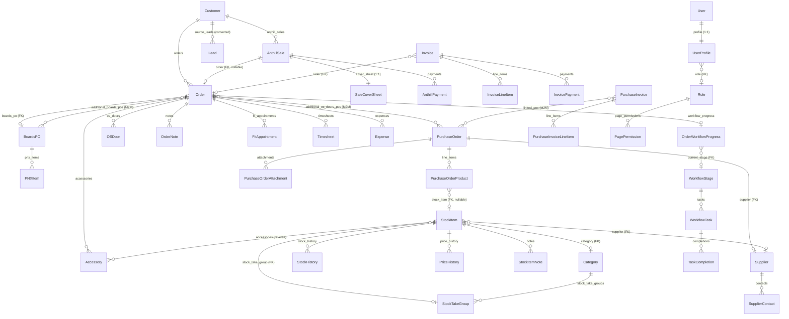

# Database Schema

PostgreSQL database accessed through Django ORM. All models live in `stock_take/models.py` (~85 models). This note documents the key relationships and how the major entities connect.

## Core entity relationship diagram



## Key model details

### Customer
The master record for each client.
- `workguru_id` — primary external ID (from WorkGuru)
- `anthill_customer_id` — Anthill CRM customer ID (for matching)
- `xero_id` — Xero contact ID
- `location` — branch / region (e.g. `nottingham`, `belfast`)
- Has many `AnthillSale`, `Order`, `Lead` records

### AnthillSale
An individual sale activity imported from Anthill CRM.
- `anthill_activity_id` — unique; used as stable identifier across syncs
- `contract_number` — the authoritative location/order reference (e.g. `NTG-KW-420968`)
- FK to `Customer` (nullable until matched)
- FK to `Order` (nullable; set when an Order is created from the sale)
- One-to-one `SaleCoverSheet`
- Many `AnthillPayment` records (sourced from Xero via contract number matching)

### Order
The production record created when a sale is placed into manufacturing.
- `sale_number` — 6-char sale reference; used to match PNX rows
- `customer_number` — 6-char CAD number
- FK to `Customer`
- FK to `BoardsPO` (primary boards PO)
- M2M to `BoardsPO` (`additional_boards_pos`)
- M2M to `PurchaseOrder` (`additional_os_doors_pos`)
- Reverse FKs: `Accessory`, `OSDoor`, `FitAppointment`, `Timesheet`, `Expense`, `OrderNote`
- Financial fields: `materials_cost`, `installation_cost`, `manufacturing_cost`, `total_value_inc_vat`
- Workflow: `OrderWorkflowProgress` (one per stage the order has been through)

### BoardsPO
Represents a batch of boards (PNX file) sent to the board-cutting machine.
- `po_number` — unique PO reference
- `file` — original PNX file
- `csv_file`, `dwg_file` — generated variants
- Reverse FK `pnx_items` → individual board items

### PNXItem
Individual board cut from a PNX file.
- FK to `BoardsPO`
- `customer` contains the `sale_number` of the order this board belongs to
- `received_quantity` / `cnt` track delivery
- Cost calculated from dimensions × `PRICE_PER_SQM`

### PurchaseOrder
A purchase order raised to a supplier.
- States: `Draft → Approved → Ordered/Sent → Partially Received → Received → Invoiced`
- FK to `Supplier`
- Reverse FK `line_items` → `PurchaseOrderProduct`
- M2M to `PurchaseInvoice` via `link_purchase_invoice`
- M2M to `Timesheet` and `Expense` (labour costs associated with the PO)
- `display_number` — the human-readable PO number shown in UI and emails

### PurchaseOrderProduct
A line item on a purchase order.
- FK to `PurchaseOrder`
- FK to `StockItem` (nullable — non-stock lines have no stock item)
- `order_quantity`, `received_quantity` — track fulfilment
- When received, `StockItem.quantity` is incremented and a `StockHistory` record is created

### StockItem
The product catalogue and stock ledger.
- `sku` — primary business identifier
- `quantity` — current on-hand count
- `cost` / `pack_cost_price` / `pack_size` — pricing; `sync_pack_pricing()` keeps them consistent
- `par_level` — triggers shortage alerts
- FK to `Category`, `Supplier`, `StockTakeGroup`
- Reverse FKs: `Accessory`, `PurchaseOrderProduct`, `StockHistory`, `PriceHistory`
- `ProductLink` — cross-sells / auto-includes (self-referential M2M via through model)

### Accessory
A CSV-imported accessory line on an order.
- FK to `Order`
- FK to `StockItem` (nullable — set during CSV processing by SKU lookup)
- `missing=True` when the SKU was not found in stock
- `is_allocated` + `allocated_date` — records when stock was physically deducted
- `ordered=True` when a PO has been raised for the item

### Invoice
A sales invoice raised against an order.
- FK to `Order`
- `xero_invoice_id` — synced Xero invoice UUID
- Reverse FK `line_items` → `InvoiceLineItem`
- Reverse FK `payments` → `InvoicePayment`

### PurchaseInvoice
A supplier invoice received (inbound).
- Linked to one or more `PurchaseOrder` records (M2M)
- `xero_bill_id` — synced Xero bill UUID
- Parsed from PDF via `pdfplumber` in the Accounts Payable flow
- Linked to `MailboxEmail` when created from the AP inbox

### UserProfile
Extends Django's built-in `User` model (OneToOne).
- FK to `Role`
- `selected_location` — user's current branch filter
- `dark_mode` — theme preference
- `linked_fitter` — FK to `Fitter` (for scheduling)

### Role + PagePermission
RBAC system.
- `Role` — named role (e.g. `admin`, `production`, `sales`, `fitter`)
- `PagePermission` — FK to `Role`, stores `page_codename` + `can_view / can_create / can_edit / can_delete` booleans
- Page codenames map 1-to-1 with URL name groups defined in `URL_TO_PAGE` in `permissions.py`

### Workflow models
- `WorkflowStage` — named stage (e.g. `Design Check`, `Ordering`, `Fit`)
- `WorkflowTask` — checkbox items within a stage
- `TaskCompletion` — FK to `WorkflowTask` + FK to `Order`; records when each task was ticked off
- `OrderWorkflowProgress` — FK to `Order`, tracks current stage and stage dates

## Key identifier chains

The codebase uses several identifier chains to match records across systems:

| Chain | Purpose |
|---|---|
| `AnthillSale.contract_number` → Xero invoice `Reference` field | Match Xero invoices to Anthill sales for payment reconciliation |
| `Order.sale_number` ≈ `PNXItem.customer` | Link boards in a PNX file to their order |
| `AnthillSale.anthill_activity_id` = `AnthillOrderToPlace.contract_number` | Match Anthill workflow orders to local sales |
| `Customer.workguru_id` | Sync customers from WorkGuru |
| `StockItem.sku` = `Accessory.sku` | Link CSV-imported accessories to catalogue items |
| `PurchaseOrder.display_number` = `Order.os_doors_po` | Link OS Doors PO to an order |
| `Supplier.workguru_id` | Sync suppliers from WorkGuru |

## Database conventions

- **Primary keys**: auto-increment integer (`id`) on all models
- **Soft deletes**: not used — records are hard-deleted, with some models having `resolved` / `is_active` flags
- **Timestamps**: most models have `created_at` (auto_now_add) and `updated_at` (auto_now)
- **JSON fields**: used on `Customer.raw_data`, `SaleCoverSheetHistory.changes`, `ActivityLog` for semi-structured data
- **Indexes**: explicit `db_index=True` and `class Meta: indexes` on high-traffic lookup fields (e.g. `StockItem.sku`, `AnthillSale.anthill_activity_id`, `PurchaseOrder.display_number`)
- **`select_related` / `prefetch_related`**: used extensively in list views to avoid N+1 queries

## Migrations

All schema changes are managed via Django migrations in `stock_take/migrations/`.

```bash
# Create a migration after model changes
python manage.py makemigrations stock_take

# Apply pending migrations
python manage.py migrate
```

## Related
- [[Data Models]]
- [[Order Lifecycle]]
- [[Financial Flow]]
- [[Inventory Management]]
- [[Workflow System]]
- [[Page Construction]]
