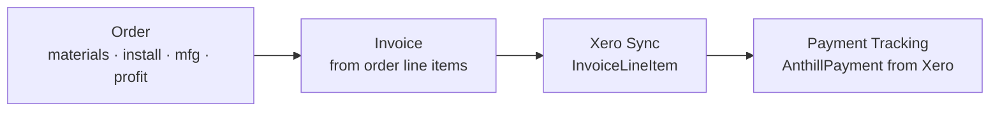

# Financial Flow

How money moves through Atlas, from order costing to reconciled payment.

## Order costing
`Order` carries `materials_cost`, `installation_cost`, `manufacturing_cost`, and `profit`.

## Invoicing
- Sales invoice (`Invoice` + `InvoiceLineItem`) generated from order lines.
- Purchase invoices (`PurchaseInvoice`) come from suppliers, optionally via the
  Accounts Payable email-to-invoice pipeline (MS Graph).

## Xero sync → [[Integrations|Xero]]
- Invoices and line items pushed to Xero.
- GL codes (`GLCode` / `EnabledGLCode`) categorise expenses.

## Payment reconciliation
- Xero invoices matched to Anthill sales via **contract number** (Reference field).
- Payments split across multiple sales if an invoice links to N sales.
- Manual payment entries supported for legacy records.
- `payment_ignored` flag excludes specific records.

## Related
- [[Order Lifecycle]]
- [[Data Models]]
- repo memory: `invoice-price-propagation`, `payments-feature`
