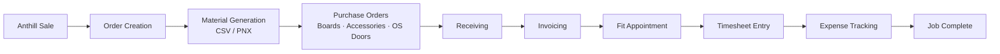

# Order Lifecycle

The end-to-end path of an order through Atlas.

## Stages
1. **Anthill Sale** — sale imported from [[Integrations|Anthill CRM]] (`AnthillSale`).
2. **Order Creation** — `Order` created and linked by contract number.
3. **Material Generation** — [[App - material_generator]] produces CSV / PNX outputs.
4. **Purchase Orders** — boards (`BoardsPO`), accessories (`Accessory`), outsourced doors (`OSDoor`).
5. **Receiving** — PO status moves Ordered → Received.
6. **Invoicing** — sales invoice generated from order line items → [[Financial Flow]].
7. **Fit Appointment** — `FitAppointment` scheduled on the fit board.
8. **Timesheet & Expenses** — `Timesheet` (hours × rate) + `Expense`.
9. **Job Complete** — order finished (`job_finished=True`).

## Related
- [[Workflow System]] — the gating layer over these stages
- [[Inventory Management]]
- [[Financial Flow]]
